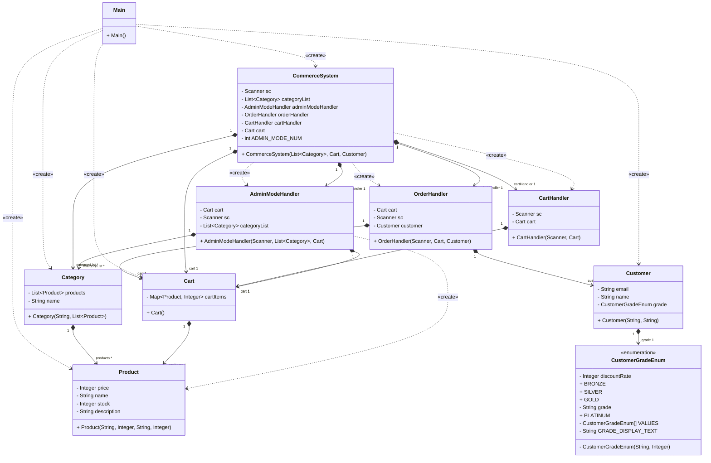
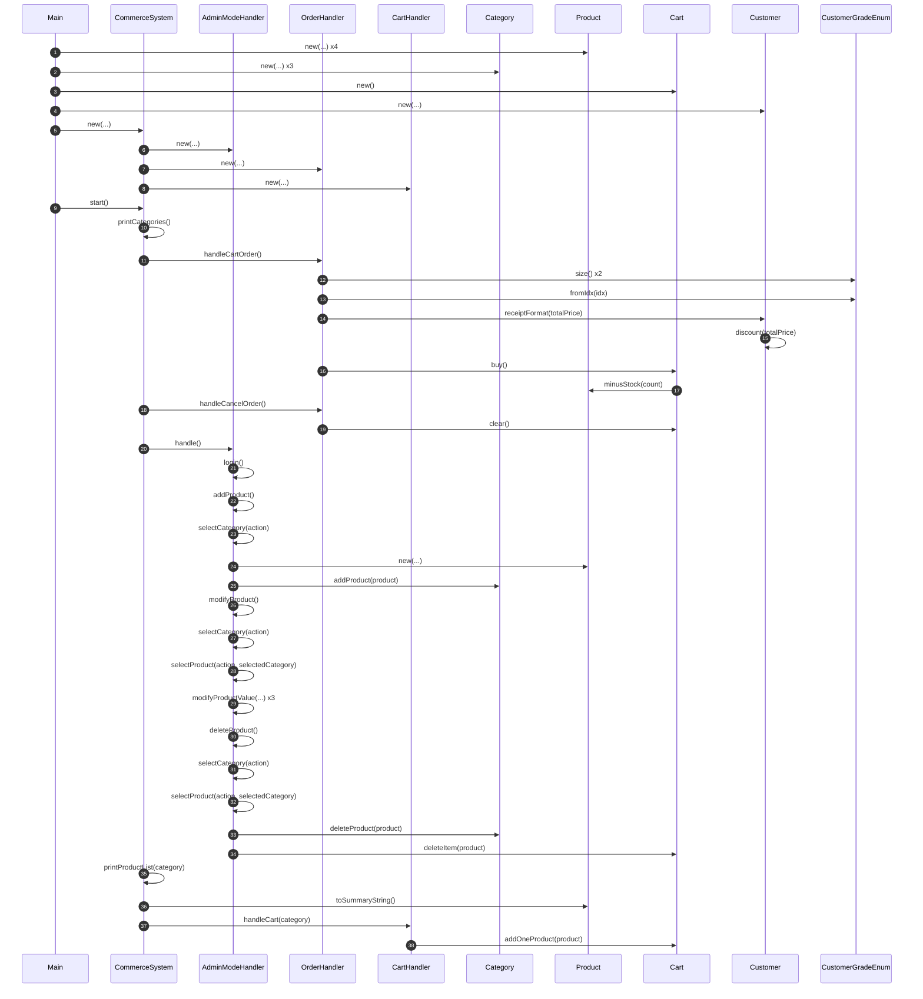

# Commerce CLI

Java로 구현한 콘솔 기반 쇼핑몰 시스템입니다.  
카테고리별 상품 조회, 장바구니 관리, 고객 등급별 할인 적용, 관리자 모드 등의 기능을 제공합니다.

---

## 주요 기능

- 카테고리별 상품 목록 조회
- 장바구니 담기 / 수량 변경 / 삭제
- 고객 등급(BRONZE / SILVER / GOLD / PLATINUM)에 따른 할인 적용
- 관리자 모드: 상품 추가 / 재고 관리

## 실행 결과

<details>
<summary>상품 구매 플로우</summary>

```
[ 실시간 커머스 플랫폼 메인 ]
1. 전자제품
2. 의류
3. 식품
0. 종료             | 프로그램 종료
6. 관리자 모드
1
[ 전자제품 ]
1. Galaxy S25      | 1,200,000원 | 최신 안드로이드 스마트폰
2. iPhone 16       | 1,350,000원 | Apple의 최신 스마트폰
3. MacBook Pro     | 2,400,000원 | M3 칩셋이 탑재된 노트북
4. AirPods Pro     |   350,000원 | 노이즈 캔슬링 무선 이어폰
0. 종료             | 프로그램 종료
1
선택한 상품: Galaxy S25      | 1,200,000원 | 최신 안드로이드 스마트폰 | 재고: 10개

위 상품을 장바구니에 추가하시겠습니까?
1. 확인	2.취소
1
Galaxy S25가 장바구니에 추가되었습니다.
[ 실시간 커머스 플랫폼 메인 ]
1. 전자제품
2. 의류
3. 식품
0. 종료             | 프로그램 종료
6. 관리자 모드

[ 주문 관리 ]
4. 장바구니 확인    | 장바구니를 확인 후 주문합니다.
5. 주문 취소       | 진행중인 주문을 취소합니다.

1
[ 전자제품 ]
1. Galaxy S25      | 1,200,000원 | 최신 안드로이드 스마트폰
2. iPhone 16       | 1,350,000원 | Apple의 최신 스마트폰
3. MacBook Pro     | 2,400,000원 | M3 칩셋이 탑재된 노트북
4. AirPods Pro     |   350,000원 | 노이즈 캔슬링 무선 이어폰
0. 종료             | 프로그램 종료
1
선택한 상품: Galaxy S25      | 1,200,000원 | 최신 안드로이드 스마트폰 | 재고: 10개

위 상품을 장바구니에 추가하시겠습니까?
1. 확인	2.취소
1
Galaxy S25가 장바구니에 추가되었습니다.
[ 실시간 커머스 플랫폼 메인 ]
1. 전자제품
2. 의류
3. 식품
0. 종료             | 프로그램 종료
6. 관리자 모드

[ 주문 관리 ]
4. 장바구니 확인    | 장바구니를 확인 후 주문합니다.
5. 주문 취소       | 진행중인 주문을 취소합니다.

1
[ 전자제품 ]
1. Galaxy S25      | 1,200,000원 | 최신 안드로이드 스마트폰
2. iPhone 16       | 1,350,000원 | Apple의 최신 스마트폰
3. MacBook Pro     | 2,400,000원 | M3 칩셋이 탑재된 노트북
4. AirPods Pro     |   350,000원 | 노이즈 캔슬링 무선 이어폰
0. 종료             | 프로그램 종료
3
선택한 상품: MacBook Pro     | 2,400,000원 | M3 칩셋이 탑재된 노트북 | 재고: 10개

위 상품을 장바구니에 추가하시겠습니까?
1. 확인	2.취소
1
MacBook Pro가 장바구니에 추가되었습니다.
[ 실시간 커머스 플랫폼 메인 ]
1. 전자제품
2. 의류
3. 식품
0. 종료             | 프로그램 종료
6. 관리자 모드

[ 주문 관리 ]
4. 장바구니 확인    | 장바구니를 확인 후 주문합니다.
5. 주문 취소       | 진행중인 주문을 취소합니다.

4
[ 장바구니 내역 ]
Galaxy S25      | 1,200,000원 | 최신 안드로이드 스마트폰 | 수량: 2개
MacBook Pro     | 2,400,000원 | M3 칩셋이 탑재된 노트북 | 수량: 1개
[ 총 주문 금액 ]
4,800,000

1. 주문 확정	 2. 메인으로 돌아가기
1
고객 등급을 입력해주세요.
1. BRONZE   :  0% 할인
2. SILVER   :  5% 할인
3. GOLD     : 10% 할인
4. PLATINUM : 15% 할인

3
주문이 완료되었습니다!
할인 전 금액: 4,800,000원
GOLD 등급 할인(10%): -480,000원
최종 결제 금액: 4,320,000원

Galaxy S25 재고가 10개 -> 8개로 업데이트되었습니다.
MacBook Pro 재고가 10개 -> 9개로 업데이트되었습니다.
```

</details>

<details>
<summary>관리자 상품수정 플로우</summary>

```
[ 실시간 커머스 플랫폼 메인 ]
1. 전자제품
2. 의류
3. 식품
0. 종료             | 프로그램 종료
6. 관리자 모드
6
관리자 비밀번호를 입력해주세요:
admin123
[ 관리자 모드 ]
1. 상품 추가
2. 상품 수정
3. 상품 삭제
4. 전체 상품 현황
0. 메인으로 돌아가기

2
어느 카테고리에 상품을 수정하시겠습니까?
1. 전자제품
2. 의류
3. 식품
1
[ 전자제품 카테고리에 상품 수정 ]
수정할 상품명을 입력해주세요: Galaxy S25
현재 상품 정보: Galaxy S25      | 1,200,000원 | 최신 안드로이드 스마트폰 | 재고: 8개
수정할 항목을 선택해주세요:
1. 가격
2. 설명
3. 재고수량

1
현재 가격: 1,200,000
새로운 가격을 입력해주세요: 15000000
Galaxy S25의 가격이 1,200,000원 -> 15,000,000원으로 수정되었습니다.

[ 관리자 모드 ]
1. 상품 추가
2. 상품 수정
3. 상품 삭제
4. 전체 상품 현황
0. 메인으로 돌아가기

4
[ 전자제품 ]
Galaxy S25      |15,000,000원 | 최신 안드로이드 스마트폰 | 재고: 8개
iPhone 16       | 1,350,000원 | Apple의 최신 스마트폰 | 재고: 10개
MacBook Pro     | 2,400,000원 | M3 칩셋이 탑재된 노트북 | 재고: 9개
AirPods Pro     |   350,000원 | 노이즈 캔슬링 무선 이어폰 | 재고: 10개

[ 의류 ]

[ 식품 ]

```

</details>

<details>
<summary>재고 없을 때 주문플로우</summary>


```
[ 실시간 커머스 플랫폼 메인 ]
1. 전자제품
2. 의류
3. 식품
0. 종료             | 프로그램 종료
6. 관리자 모드
6
관리자 비밀번호를 입력해주세요:
admin123
[ 관리자 모드 ]
1. 상품 추가
2. 상품 수정
3. 상품 삭제
4. 전체 상품 현황
0. 메인으로 돌아가기

2
어느 카테고리에 상품을 수정하시겠습니까?
1. 전자제품
2. 의류
3. 식품
1
[ 전자제품 카테고리에 상품 수정 ]
수정할 상품명을 입력해주세요: Galaxy S25
현재 상품 정보: Galaxy S25      |15,000,000원 | 최신 안드로이드 스마트폰 | 재고: 8개
수정할 항목을 선택해주세요:
1. 가격
2. 설명
3. 재고수량

3
현재 재고수량: 8
새로운 재고수량을 입력해주세요: 0
Galaxy S25의 재고수량이 8 -> 0로 수정되었습니다.
[ 관리자 모드 ]
1. 상품 추가
2. 상품 수정
3. 상품 삭제
4. 전체 상품 현황
0. 메인으로 돌아가기

0
[ 실시간 커머스 플랫폼 메인 ]
1. 전자제품
2. 의류
3. 식품
0. 종료             | 프로그램 종료
6. 관리자 모드
1
[ 전자제품 ]
1. Galaxy S25      |15,000,000원 | 최신 안드로이드 스마트폰
2. iPhone 16       | 1,350,000원 | Apple의 최신 스마트폰
3. MacBook Pro     | 2,400,000원 | M3 칩셋이 탑재된 노트북
4. AirPods Pro     |   350,000원 | 노이즈 캔슬링 무선 이어폰
0. 종료             | 프로그램 종료
1
선택한 상품: Galaxy S25      |15,000,000원 | 최신 안드로이드 스마트폰 | 재고: 0개

위 상품을 장바구니에 추가하시겠습니까?
1. 확인	2.취소
1
Galaxy S25가 장바구니에 추가되었습니다.
[ 실시간 커머스 플랫폼 메인 ]
1. 전자제품
2. 의류
3. 식품
0. 종료             | 프로그램 종료
6. 관리자 모드

[ 주문 관리 ]
4. 장바구니 확인    | 장바구니를 확인 후 주문합니다.
5. 주문 취소       | 진행중인 주문을 취소합니다.

4
[ 장바구니 내역 ]
Galaxy S25      |15,000,000원 | 최신 안드로이드 스마트폰 | 수량: 1개
[ 총 주문 금액 ]
15,000,000

1. 주문 확정	 2. 메인으로 돌아가기
1
고객 등급을 입력해주세요.
1. BRONZE   :  0% 할인
2. SILVER   :  5% 할인
3. GOLD     : 10% 할인
4. PLATINUM : 15% 할인

3
재고가 부족한 상품이 존재합니다
[ 실시간 커머스 플랫폼 메인 ]
1. 전자제품
2. 의류
3. 식품
0. 종료             | 프로그램 종료
6. 관리자 모드

[ 주문 관리 ]
4. 장바구니 확인    | 장바구니를 확인 후 주문합니다.
5. 주문 취소       | 진행중인 주문을 취소합니다.
```

</details>

---

## 객체 구조

- mermaid diagram



- sequence diagram



---

## 회고

설계 없이 바로 코딩 하면서 과제를 순차적으로 해결하며 코딩하다 보니, 기능을 추가할수록 기존 클래스에 맞춰 억지로 끼워 맞추는 느낌이 강해졌습니다.  
처음에는 간단해 보였던 구조가 점점 얽히면서 객체지향 원칙이 흔들리고, 책임이 여러 클래스에 분산되거나 한 곳에 과하게 몰리는 문제가 생겼습니다.

결국 마무리 후에는 대량 리팩토링 과정을 거쳐야했습니다.

> 이번 프로젝트를 통해 **설계의 중요성**을 몸으로 느꼈습니다.  
> 다음부터는 설계를 하고 필요한 클래스, 객체관의 관계 등을 먼저 정리한 뒤 구현에 들어가는 습관을 꼭 들이겠습니다.
